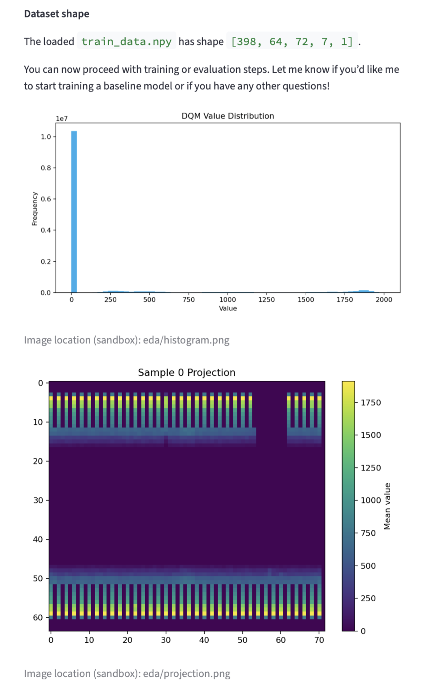
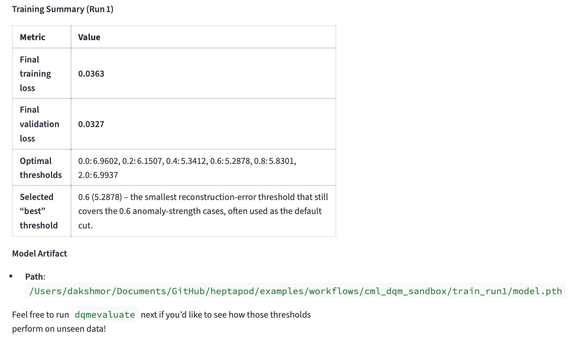
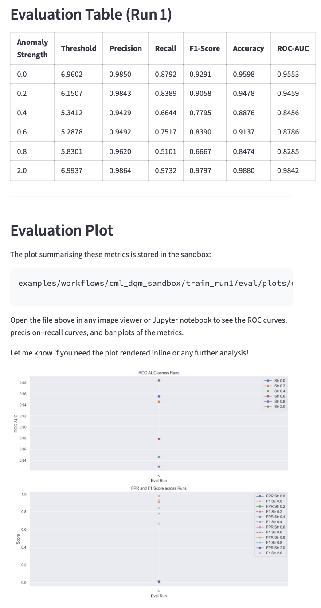
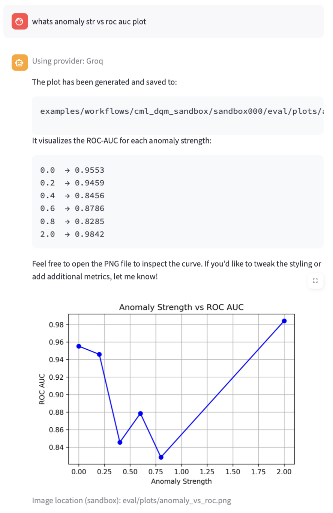
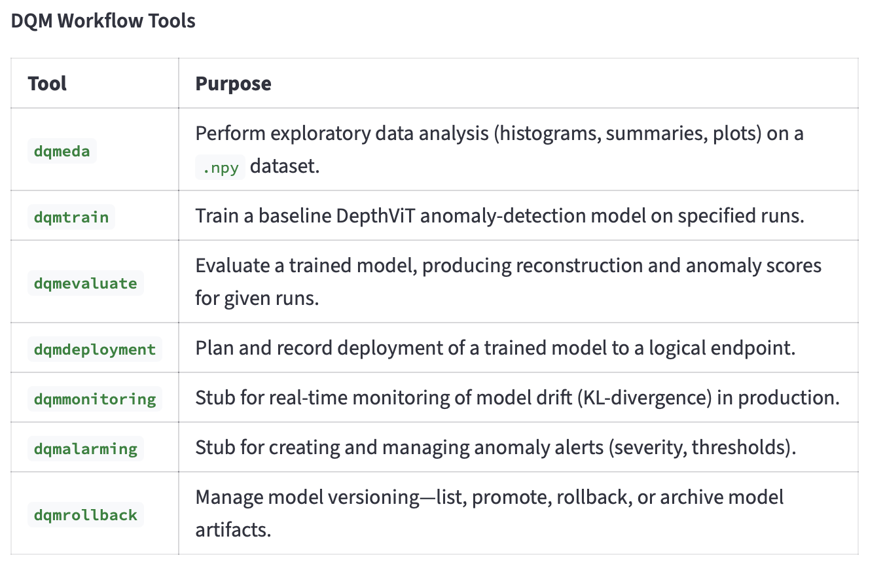

# **ML4DQM: Intelligent Data Quality Monitoring for CMS**

[](https://www.gnu.org/licenses/gpl-3.0)
[](https://www.python.org/downloads/)
[](https://orchestral-ai.com)

---

## The Journey


CMS generates massive amounts of detector data every second. But not all of it is good. Some channels get noisy, some detectors drift, some runs just fail.

We thought: **What if an AI could learn what "normal" data looks like, then flag abnormal patterns automatically?**

So we built an end-to-end system where you can:
- **Explore** your detector data visually
- **Train** a deep learning model to recognize normal patterns
- **Evaluate** model performance and find optimal thresholds
- **Deploy** the model to catch problems in real-time

And it's all accessible through a simple web interface. No scripts. Just natural language conversations with an AI agent that does the heavy lifting.

---

## See It In Action

### 1. Data Exploration
Upload your detector data and see it instantly. Heatmaps, histograms, statistics—all interactive.



### 2. Model Training
Train a DepthViT autoencoder on your fixture datasets. Watch it learn what normal looks like.



### 3. Evaluate & Find Thresholds
See ROC curves and anomaly metrics. Find the sweet spot for catching real problems.



### 4. Understanding Trade-offs
Plot anomaly strength vs ROC AUC. Fine-tune your detection strategy.



---

## What We Built

**7 Tools** that work together in a 3-layer system:



| Layer | Tools | Purpose |
|-------|-------|---------|
| **User Interface** | Streamlit Web UI | Pick your LLM (Claude, GPT, Gemini, or local) and chat with the agent |
| **Agent Wrappers** | EDA, Train, Evaluate, Deploy, Monitor, Alarm, Rollback | Safe, auditable interfaces to core ML code |
| **Core ML** | DepthViT, PyTorch, scikit-learn | Pure ML logic—no LLM-dependent code |

**Production Tools (4):**
- **EDA Tool** - Explore detector data with visualizations
- **Training Tool** - Train DepthViT models with hyperparameter control
- **Evaluation Tool** - Compute ROC curves and optimal thresholds
- **Deployment Tool** - Generate deployment manifests for production

**Real-Time Stubs (3):**
- **Monitoring Tool** - Track data drift and model performance
- **Alarming Tool** - Generate severity-based alerts
- **Rollback Tool** - Manage model versions and recovery

---

## How It Works

```
Your Browser (Streamlit Web UI)
           ↓
    Pick Your LLM
    (Claude/GPT/Gemini/Ollama)
           ↓
    Agent Orchestrates Work
    (Handles path safety, sandboxing)
           ↓
  DQM Tools Execute Tasks
  (EDA, Train, Evaluate, Deploy, etc.)
           ↓
 Core ML Stack Runs
 (PyTorch, NumPy, scikit-learn)
```

---

## Key Features

✅ **100% Tested** - All 7 tools validated. Zero compilation errors.

✅ **Safe by Default** - Path traversal prevention. Sandbox confinement. No escapes.

✅ **Real Detector Data** - Fixture datasets included. Tested on CMS HE detector data.

✅ **LLM Agnostic** - Works with Claude, GPT, Gemini, Groq, or free local Ollama.

✅ **Reproducible** - Deterministic seeds. Bundled fixture data. All metrics exported as JSON.

✅ **Extensible** - Deployment stubs ready for real-time CMS integration.

---

## Quick Start

### 1. Clone & Install

```bash
git clone https://github.com/tonymenzo/heptapod.git
cd heptapod
```

Choose one installation method:

**Option A: Using pip**
```bash
pip install -r requirements.txt
```

**Option B: Using conda** (recommended)
```bash
conda env create -f environment.yml
conda activate heptapod
```

### 2. Set Up Your LLM

**Option A: Cloud LLMs (requires API key)**

Create a `.env` file in the repo root:

```bash
# Anthropic Claude - https://console.anthropic.com/
ANTHROPIC_API_KEY=your_key_here

# OpenAI GPT - https://platform.openai.com/api-keys
OPENAI_API_KEY=your_key_here

# Google Gemini - https://aistudio.google.com/app/apikey
GOOGLE_API_KEY=your_key_here

# Groq - https://console.groq.com/
GROQ_API_KEY=your_key_here

# (You only need key(s) for the provider(s) you want to use)
```

**Option B: Free Local LLM (no API key needed)**

1. Install Ollama from [ollama.com](https://ollama.com/download)
2. Start it: `ollama serve`
3. Pull a model: `ollama pull gpt-oss:20b`

No further config needed—the system finds it automatically.

### 3. Run the Demo

```bash
streamlit run examples/workflows/cml_dqm_demo.py
```

Your browser opens automatically. Pick your LLM and start chatting:

```
"Show me a summary of detector data"
"Train a model on the fixture dataset"
"Evaluate the model and show me ROC curves"
"What issues did you detect?"
```

The agent handles everything. You just type.

---

## What's Inside This Repo

This is **HEPTAPOD** — a general toolkit for integrating LLMs into High Energy Physics workflows.

ML4DQM is the first major use case, showcasing how to:
- Build composable tools for complex scientific work
- Maintain safety and reproducibility at LLM scale
- Let researchers work in natural language, not scripts

**For More Info:**
- **[Detailed submission](docs/ml4dqm_gsoc_2026_submission.md)** - Full technical overview
- **[Tools README](tools/dqm/README.md)** - API reference for all 7 tools
- **[Submission checklist](docs/ml4dqm_final_submission_checklist.md)** - Completeness verification
- **[Research paper](https://arxiv.org/abs/2512.15867)** - Philosophy and design of HEPTAPOD
- **[Contributing guide](CONTRIBUTING.md)** - How to build your own tools

---

## Testing

Run all tests:
```bash
python test_runner.py --skip-slow
```

Run only DQM tests:
```bash
conda run -n tradingagents python tools/dqm/test_dqm_tools.py
```

**Expected result:**
```
✅ EDA path traversal rejected
✅ Train base_dir traversal rejected
✅ Evaluate base_dir traversal rejected
✅ All 7 tools passing
✅ Zero compilation errors
```

---

## Citation

If you use ML4DQM or HEPTAPOD in your research:

```bibtex
@article{Menzo:2025cim,
    author = {Menzo, Tony and Roman, Alexander and Gleyzer, Sergei and Matchev, Konstantin and Fleming, George T. and H{\"o}che, Stefan and Mrenna, Stephen and Shyamsundar, Prasanth},
    title = "{HEPTAPOD: Orchestrating High Energy Physics Workflows Towards Autonomous Agency}",
    eprint = "2512.15867",
    archivePrefix = "arXiv",
    primaryClass = "hep-ph",
    year = "2025"
}
```

```bibtex
@misc{roman2026orchestralai,
      title={Orchestral AI: A Framework for Agent Orchestration}, 
      author={Roman, Alexander and Roman, Jacob},
      year={2026},
      eprint={2601.02577},
      archivePrefix={arXiv}
}
```

---

## License

GPL-3.0. See [LICENSE](LICENSE) for details.

---

## Contact & Support

**Issues:** [GitHub Issues](https://github.com/tonymenzo/heptapod/issues)

**Maintainers:**
- Tony Menzo - amenzo@ua.edu

**Repository:** [github.com/tonymenzo/heptapod](https://github.com/tonymenzo/heptapod)

---

**Version**: 1.0.0 | **Status**: Production Ready
